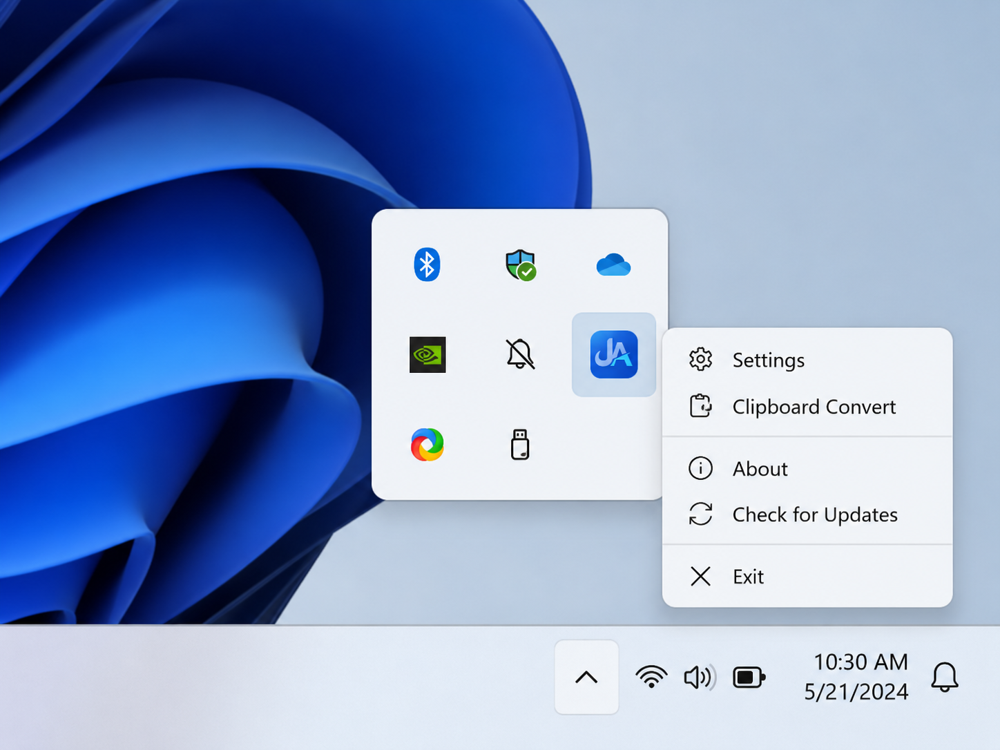

<div align="center">


<br>


<br><br>


<br><br>


</div>

---

# LayFix

Instant keyboard layout fixer for Arabic and English mixed text.

LayFix is a lightweight tray-first utility that fixes accidental keyboard layout mistakes directly inside selected text.

Select text anywhere, press the shortcut, and LayFix replaces only the selected content with the corrected version.

No cloud conversion.
No telemetry.

---

# 🖼️ Preview

## Application Icon

<p align="center">
  
</p>

---

## Tray Placement

<p align="center">
  
</p>

---

# 🧪 Examples

## Arabic typed on English layout

```text id="y8x2af"
hgsghl ugd;l
```

Result:

```text id="g1w4nz"
السلام عليكم
```

---

## English typed on Arabic layout

```text id="q9k2vd"
اثممخ LayFix
```

Result:

```text id="t6r3ow"
hello LayFix
```

---

## Mixed Text

```text id="z2u7fj"
pdh fhg; LayFix
```

Result:

```text id="m8x0cs"
حيا بالك LayFix
```

---

# ⚡ Features

* Tray-first application
* Selected-text replacement only
* Clipboard Convert mode
* Dark / Light / Follow System themes
* Global shortcuts
* Settings panel
* Optional History
* Startup with Windows toggle
* Local-only conversion
* No telemetry or analytics

---

# 🧭 Usage

1. Launch LayFix
2. Find the icon in the system tray
3. Select text in any application
4. Press the conversion shortcut
5. LayFix converts and replaces only the selected text

Default shortcut:

```text id="f2k6vx"
Ctrl + Alt + F9
```

---

# 📋 Tray Menu

```text id="r3m1la"
Settings
Clipboard Convert
About
Check for Updates
Exit
```

---

# 🔒 Privacy

LayFix is designed to stay local.

* No telemetry
* No analytics
* No cloud conversion
* No text uploading
* No automatic history storage

`Check for Updates` only connects to GitHub Releases when triggered manually by the user.

---

# 📂 Project Structure

```text id="u7w5eb"
LayFix/
  README.md
  LayFix.sln

  docs/
    images/
      layfix-icon.png
      tray-reference.png

  src/
    LayFix.Core/
    LayFix.Windows/
    LayFix.Linux/

  tests/
    LayFix.Core.Tests/
    LayFix.Windows.IntegrationTests/

  installer/
    LayFix.wxs

  release/
    LayFix-portable.exe
    LayFix-installer.msi
    LayFix-linux-x64
```

---

# 🛠️ Build

```powershell id="k1u9xe"
dotnet restore LayFix.sln
dotnet build LayFix.sln -c Release
```

Run Windows version:

```powershell id="q0d3nw"
dotnet run --project src\LayFix.Windows\LayFix.Windows.csproj -c Release
```

---

# 📦 Build Portable EXE

```powershell id="e8z4km"
dotnet publish src\LayFix.Windows\LayFix.Windows.csproj `
  -p:PublishProfile=portable-win-x64 `
  -o artifacts\publish\LayFix-win-x64
```

---

# 📦 Build MSI Installer

```powershell id="v5n2pw"
dotnet tool install --global wix
```

```powershell id="u1k7zr"
wix build installer\LayFix.wxs `
  -d PublishDir="$PWD\artifacts\publish\LayFix-win-x64" `
  -o artifacts\installer\LayFix.msi
```

---

# 🔄 Check for Updates

LayFix compares the current version with:

```text id="p7f3lh"
https://github.com/XTUFA7/LayFix/releases/latest
```

---

# 👤 0xTuFa7

* X → https://x.com/0xtufa7
* GitHub → https://github.com/XTUFA7
* Instagram → https://instagram.com/_BB5BB

---

<div align="center">


<br><br>


</div>
